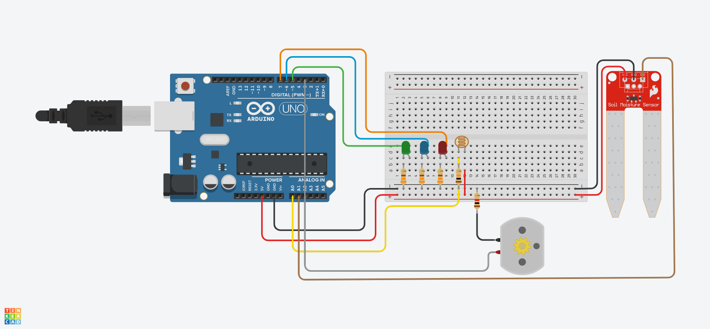

<h2 align=center>
  Horta Automatizada
</h2>

### 🏁 》Introdução
Esse é um projeto feito como avaliação de um curso de extensão da faculdade sobre arduino e IOT, 
em resumo esse é um projeto simples para automatizar o processo de irrigação de uma horta.

### ⚙ 》Componentes
- Arduino UNO R3
- LDR (fotoresistor)
- Higrômetro (sensor de umidade do solo)
- Solenoid **
- Rele 5V ***
- 3 LED`s
- 3 resistores de 330 ohm`s
- 1 resistor de 10k ohm`s
- 1 resistor de 1k ohm`s

** O tinkercad não possui uma solenoid na sua biblioteca de componentes, então eu a substituí por uma motor cc.

*** O tinkercad não possui um rele 5V na sua biblioteca de componentes, e infelizmente eu não achei nada para substituir.

### 📃 》Descrição
O funcionamento é bem simples, só precisamos entender qual foi os dados utilizados para escrever a lógica do programa.

| **Sol forte**  | **Sol moderado** |
| ------------- | ------------- | 
| luminosidade entre 0 - 200  | luminosidade entre 201 - 800   |  

| **Solo seco**  | **Solo normal** | 
| ------------- | ------------- | 
| umidade entre 801 - 2013  | umidade entre 501 - 800   | 

Levando em conta esses dados a lógica usada foi a seguinte:
Se o sol está forte, independente de como está o solo a solenoid não é acionada e as plantas não recebem água,
Isso porque pode ser prejudicial regar as plantas com o sol intenso. No entanto, caso o solo esteja seco o led vermelho irá acender para informar a situação.

Já no caso do sol estar moderado, se o solo estiver seco a solenoid é acionada e espera um delay de 10 s para verificar se a condição muda, se o solo se manter 
seco ele ativa a solenoid novamente e assim ela fica em loop até o solo se estabilizar, o led azul fica acesso durante o processo para informar que a horta está sendo 
regada.

Mas e quando é de noite? e se a planta ficar com muita água?
Pois bem, na parte da noite não é aconselhável regar as plantas pois elas não absorvem direito a água e as folhas demoram para secar. Bem na lógica que eu escrevi
ela para de regar as plantas quando o solo chega a 650 de umidade, então via de regra a planta não vai estar com muita água, e mesmo que chova muito o sensor não
vai ter uma leitura  de solo normal nem seco então ele não vai regar.

## 📷 》Imagens do projeto

